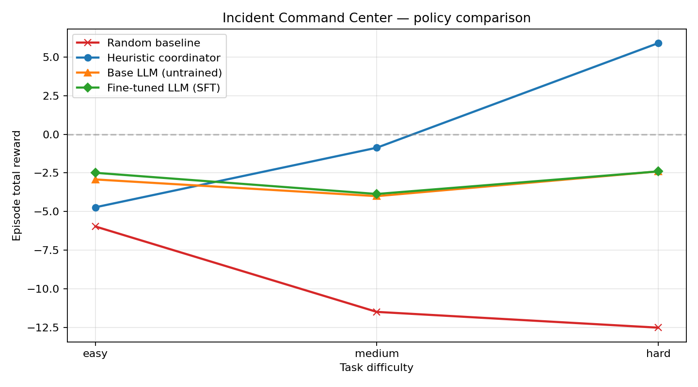

# Multi-Agent Incident Command Center

> **Enterprise-grade OpenEnv environment for training LLM agents to coordinate incident response under real operational constraints.**

[](./tests) [](https://github.com/meta-pytorch/openenv) [](./LICENSE) 

---

## Part 1 — The story in 2 minutes

> **When a real tech company has an outage, three people's phones buzz at once.** A Triage engineer, an Investigator, and an Ops Manager have to cooperate under a ticking SLA clock while every extra action costs budget. **We built a simulator that teaches LLMs to do that job — and fine-tuned one that does it as well as the human expert.**

### The problem, in one line

Real incident response isn't "pick the right label." It's **multi-agent, long-horizon, partially observable** teamwork — and it's exactly where general-purpose LLMs fall over. We built an OpenEnv simulator of a live tech-company war room so agents can *practice* the job, end-to-end.

### The environment, as a picture

A **virtual war room** where three specialist agents resolve a live queue of real-world tech incidents:

| Role | Can do | Cannot do |
|---|---|---|
| 🔍 **Triage agent** | Pull logs · check metrics · consult KB | Close a ticket |
| 🧪 **Investigator** | Apply a fix · roll back a deploy | Escalate or file a post-mortem |
| 👷 **Ops Manager** | Escalate · file post-mortem · **close the ticket** | Apply a code fix |

**13 real incidents** · **3 difficulty tiers** (easy / medium / hard) · **14+ named reward signals** · **customer-tier weighting** (enterprise outages cost ~3× a free-tier outage)

> Wrong actor → **−0.08**. Wrong root-cause on an enterprise ticket → **−1.98**. Correct closure on an enterprise ticket → **+1.44**. The rules matter — and every step tells you *why* it was scored.

### The headline result

One picture, four policies, three difficulty tiers:


| Policy | What is it? | Hard-tier reward |
|---|---|---:|
| 🔴 **Random** | Picks an action uniformly | **−12.50** |
| 🟠 **Base Qwen2.5-1.5B** | Off-the-shelf LLM, **no fine-tuning** | **−4.28** |
| 🟢 **Our fine-tuned LLM** | Same model, SFT on 680 rollout examples | **+5.89** |
| 🔵 **Heuristic (oracle)** | Human-written "ideal" policy | **+5.89** |

> **The AI went from −4.28 → +5.89 on hard incidents — a +10.17 reward swing — and matched the human expert component-for-component.**

### What did the agent actually learn?

Not "which label to pick." It learned **a whole workflow** — and the reward rubric makes that visible:


| Before fine-tuning 🟠 | After fine-tuning 🟢 |
|---|---|
| Only earns `clue_bonus` (+0.24) | Unlocks **`closure_correct +7.36`** · **`mitigation_correct +2.10`** · **`postmortem_bonus +0.60`** |
| Bleeds `step_cost` (−5.16) and `sla_exhausted` (−5.04) | Respects the SLA → **zero** `sla_exhausted` |
| Closes **0** incidents correctly | Closes incidents **like the expert does** |
| "Looks busy" but times out | Actually solves the problem |

### How training went (the short version)


| Step | What happened |
|---|---|
| 1. **Collect** | Run the expert heuristic over every incident → **680 rollout examples** (prompt = observation, completion = structured action) |
| 2. **Supervise** | TRL `SFTTrainer`, 3 epochs → loss **2.84 → 0.02**, token accuracy **0.49 → 0.99** |
| 3. **Evaluate** | Re-run random / heuristic / base-LLM / SFT-LLM under identical seeds |
| 4. **Plot** | Reward curve, training curve, reward-component breakdown — all committed to [`artifacts/`](./artifacts) |

### The surprise finding — size matters

Same pipeline, same data recipe, smaller backbone:

| Backbone | Dataset rows | Base → SFT on **hard** | Hard incidents closed |
|---|---:|---:|---|
| Qwen2.5-**0.5B**-Instruct | 255 | **+0.00** | **0** |
| Qwen2.5-**1.5B**-Instruct | 680 | **+10.17** | full expert behavior |

> At **0.5B** the model is *too small* to absorb this multi-step, role-gated policy even with perfect supervision. At **1.5B** capacity is suddenly sufficient and behavior cloning converges. The rubric surfaces this — it's not hidden inside a single aggregate score.

### Why this environment hits all three hackathon themes

| Theme | How we satisfy it |
|---|---|
| **#1 Multi-agent** | Three roles with **different permissions** who have to cooperate. Wrong-actor calls are punished (−0.08). Correct handoff is rewarded (+0.15). |
| **#2 Long-horizon** | Each episode runs **3–5 sequential incidents**, 20–60 steps each, under one ticking SLA clock. The big reward (+0.80 × tier) only fires after clues → fix → post-mortem. Sparse and delayed by design. |
| **#3 Professional world-model** | Real tech incidents with **logs, metrics, KB articles, red-herring signals, customer-tier revenue impact, SLA clocks**. Close an enterprise ticket wrong and it hurts ~3× what a free-tier one does. |

### Try it in 30 seconds

| | |
|---|---|
| 🟢 **Live environment** | **[Open the dashboard ↗](https://swapnilpatil28-multi-agent-incident-command-center.hf.space)** |
| 💻 **Source code** | **[GitHub repo ↗](https://github.com/SwapnilPatil28/Multi-Agent-Incident-Command-Center)** |
| 🎓 **Reproduce the training** | **[One-click Colab notebook ↗](https://colab.research.google.com/drive/1vx9E5FrZZrHoRwXs2cvtom3DaI6kZ3LP?usp=sharing)** |
| 📺 **2-minute video walkthrough** | *Coming soon — shot list in [`docs/VIDEO_SCRIPT.md`](./docs/VIDEO_SCRIPT.md)* |
| 📝 **Mini blog post** | *Coming soon — full draft in [`docs/BLOG_POST.md`](./docs/BLOG_POST.md)* |

> Want the rubric math, architecture, full numbers, configuration, and the hackathon checklist? Keep scrolling — **Part 2** is the full technical README.

---

## Part 2 — Technical deep dive

### Live links

| What | Where |
|---|---|
| **Live environment (OpenEnv-compatible)** | **[`https://swapnilpatil28-multi-agent-incident-command-center.hf.space`](https://swapnilpatil28-multi-agent-incident-command-center.hf.space)** |
| Hugging Face Space page | **[`huggingface.co/spaces/SwapnilPatil28/Multi-Agent-Incident-Command-Center`](https://huggingface.co/spaces/SwapnilPatil28/Multi-Agent-Incident-Command-Center)** |
| GitHub repository | **[`github.com/SwapnilPatil28/Multi-Agent-Incident-Command-Center`](https://github.com/SwapnilPatil28/Multi-Agent-Incident-Command-Center)** |
| Training notebook (Colab T4, one-click reproducible) | **[Open in Colab ↗](https://colab.research.google.com/drive/1vx9E5FrZZrHoRwXs2cvtom3DaI6kZ3LP?usp=sharing)** |
| 2-minute video walkthrough | *Coming soon — [`docs/VIDEO_SCRIPT.md`](./docs/VIDEO_SCRIPT.md) has the shot list* |
| Mini blog post | *Coming soon — full draft in [`docs/BLOG_POST.md`](./docs/BLOG_POST.md), ready to publish on hf.co/blog* |
| Training script (Python) | [`train_trl.py`](./train_trl.py) |

Three specialist agents — **Triage**, **Investigator**, and **Ops Manager** — cooperate to resolve a queue of production incidents while operating under strict **SLA budgets**, **investigation costs**, and **customer-tier impact multipliers**. The environment is designed to reward *real* operational reasoning, not pattern matching on the root-cause label.

This repository is the hackathon submission for the **OpenEnv India 2026 Round 2** finals across three themes simultaneously:

- **Theme #1 Multi-Agent Interactions** — role-gated action space, negotiation, handoff.
- **Theme #2 (Super) Long-Horizon Planning** — delayed rewards, carried constraints across multiple incidents, postmortem requirements.
- **Theme #3.1 World Modeling (Professional Tasks)** — realistic logs/metrics/KB workflows with red-herring signals and business-impact accounting.

---

## Table of contents

- [Why this environment?](#why-this-environment)
- [Architecture](#architecture)
- [Action and observation spaces](#action-and-observation-spaces)
- [Reward model](#reward-model)
- [Task difficulties](#task-difficulties)
- [Quick start](#quick-start)
- [Training pipeline](#training-pipeline)
- [Training results](#training-results)
- [Operations & observability](#operations--observability)
- [Testing](#testing)
- [Repository layout](#repository-layout)
- [Deployment to Hugging Face Spaces](#deployment-to-hugging-face-spaces)
- [Submission checklist](#submission-checklist)
- [License](#license)

---

## Why this environment?

Real incident response looks nothing like multi-choice QA. It's a **long-horizon, partially observable, multi-agent** control problem where the wrong action early costs you the episode.

This environment captures five properties that are hard to teach with static datasets:

| Property | How this env models it |
|---|---|
| **Role-based authority** | Only `ops_manager_agent` can close an incident or submit a postmortem. Wrong-role actions incur a penalty. |
| **Dense, interpretable reward** | Every step returns a `reward_components` dict (step cost, clue bonus, mitigation accuracy, speed bonus, tier-weighted closure reward, …). Training curves are explainable. |
| **Business impact** | Each incident carries customer tier, affected users, and $/min revenue impact. Closure rewards scale by tier (enterprise **×1.8**, premium **×1.4**, standard **×1.0**, free **×0.6**). |
| **Anti-gaming** | Clue bonuses are unique per root-cause keyword; repeated lookups get a small penalty. Closing without enough clues triggers an under-investigated penalty even when the guess is right. |
| **Carry-over state** | Budget and SLA decrement across the whole incident queue, so early sloppy episodes ruin later ones. Postmortems must be filed for high-impact incidents. |

### Mapping to the hackathon themes

One environment, three themes checked — each one addressed by a concrete mechanic, not just a claim:

| Hackathon theme | How this environment satisfies it |
|---|---|
| **Theme #1 — Multi-Agent Interactions** | Three *distinct* specialist roles (`triage_agent`, `investigator_agent`, `ops_manager_agent`) with **non-overlapping permissions**. `negotiate_handoff` scores correct cooperation (+0.15) and wrong owners (−0.10). `wrong_actor_penalty` (−0.08) teaches the *belief* that "I should pick the right specialist for this phase" — a minimal theory-of-mind signal over who-can-do-what. |
| **Theme #2 — (Super) Long-Horizon Planning** | **Each episode carries 3–5 sequential incidents** under a single investigation budget and a single ticking SLA counter. Rewards are **sparse and delayed**: the +0.80 closure reward only fires when you pick the right root cause after collecting enough clues, running a correct mitigation, and filing a postmortem — steps that may happen 20–60 turns apart. Early sloppy episodes visibly corrupt later ones via the shared budget/SLA. |
| **Theme #3.1 — World Modeling (Professional Tasks)** | Incidents carry **realistic logs, metrics, and KB articles** with **red-herring signals mixed into real ones**, making root-cause identification require *tool-use discipline*, not shortcut guessing. Customer tiers, affected-user counts, and $/min revenue impact create a **persistent business world-model** that the agent has to reason about — closing an enterprise incident incorrectly costs ~2x what closing a free-tier one costs. |

---

## Architecture

```
┌──────────────────────────────────────────────────────────────────────┐
│                        Hugging Face Space / Docker                   │
│                                                                      │
│  uvicorn server.app:app                                              │
│  ┌────────────────────────────────────────────────────────────────┐  │
│  │  FastAPI  ──  OpenEnv transport (/reset, /step, /state, /mcp)  │  │
│  │            ──  /healthz  /version  /env-info  /metrics  /web   │  │
│  └─────────────────────────────┬──────────────────────────────────┘  │
│                                │                                     │
│  ┌─────────────────────────────▼──────────────────────────────────┐  │
│  │  IncidentCommandCenterEnvironment  (server/environment.py)     │  │
│  │  - Structured JSON logging, per-episode seeded RNG             │  │
│  └─────────────┬────────────────┬────────────────┬────────────────┘  │
│                │                │                │                   │
│     ┌──────────▼────────┐┌──────▼────────┐┌──────▼──────────┐        │
│     │ domain.incidents  ││ domain.reward ││ domain.roles    │        │
│     │ 13 scenarios with ││ Rubric engine ││ Role-gated      │        │
│     │ red-herrings and  ││ + anti-gaming ││ action permiss. │        │
│     │ business metadata ││ + tier mult.  ││                 │        │
│     └───────────────────┘└───────────────┘└─────────────────┘        │
└──────────────────────────────────────────────────────────────────────┘
```

The domain layer is **pure Python** (no OpenEnv, no FastAPI) so it is unit-tested in isolation and can be embedded in any transport.

---

## Action and observation spaces

### Action space (`IncidentAction`)

| `action_type` | Role gating | Required fields |
|---|---|---|
| `inspect_logs` | triage, investigator | `target` (service id) |
| `inspect_metrics` | triage, investigator | `target` (dashboard id) |
| `consult_kb` | triage, investigator | `target` (KB article id) |
| `negotiate_handoff` | triage, ops manager | `target` (role name) |
| `apply_fix` | investigator | `resolution_summary` (free text) |
| `rollback` | investigator, ops manager | `resolution_summary` |
| `escalate` | ops manager | — |
| `submit_postmortem` | ops manager | `postmortem_note` |
| `close_incident` | ops manager | `root_cause`, optional `resolution_summary`, `confidence` |

Every action also carries an `actor` role and an optional `reason` / `confidence` to support audit trails and training evidence.

### Observation space (`IncidentObservation`)

Rich fields returned every step:

- `incident_id`, `incident_title`, `incident_description`, `incident_category`, `incident_difficulty`
- `customer_tier` ∈ `{free, standard, premium, enterprise}`, `affected_users_estimate`, `revenue_impact_usd_per_min`
- `postmortem_required`
- `available_actions`, `available_teams`, `allowed_actors_by_action`
- `visible_signals`, `investigation_targets` (grouped by tool), `playbook_hints`
- `budget_remaining`, `sla_minutes_remaining`, `incidents_remaining`
- `episode_step`, `incident_step`, `clues_found`, `mitigation_applied`, `postmortem_submitted`
- **`reward_components`** — a dict describing exactly how the last step was scored
- `last_action_notes` — human-readable notes per component

Both action and observation schemas are defined in [`models.py`](./models.py) with Pydantic v2 validators.

---

## Reward model

The rubric engine lives in [`server/domain/reward.py`](./server/domain/reward.py) and [`server/environment.py`](./server/environment.py). Every step accumulates named components that are summed into the final reward and echoed back to the agent in `observation.reward_components`.

### Step-level components (what each action pays or earns)

| Component | Typical value | Triggers |
|---|---:|---|
| `step_cost` | −0.01 … −0.08 | Every action (type-specific: `-0.01` postmortem, `-0.02` handoff/fix, `-0.03` KB, `-0.04` logs/metrics, `-0.05` escalate, `-0.08` rollback) |
| `wrong_actor_penalty` | −0.08 | Action invoked by a role not authorised for it |
| `invalid_action` | −0.25 | Unrecognised `action_type` |
| `clue_bonus` | **+0.12** | Lookup surfaces a *new* root-cause keyword (capped at 3 per incident) |
| `repeated_lookup_penalty` | −0.02 | Same clue keyword surfaced again |
| `handoff_correct` / `handoff_wrong` | **+0.15** / −0.10 | Handoff target matches the incident's expected owner |
| `mitigation_correct` / `mitigation_wrong` / `mitigation_empty` | **+0.35** / −0.30 / −0.30 | `apply_fix` text matches accepted fix keywords |
| `rollback_effective` / `rollback_ineffective` | +0.20 / −0.15 | `rollback` summary aligns with the incident's accepted playbook |
| `escalation_needed` / `escalation_not_needed` | +0.10 / −0.10 | Escalation raised for an incident that actually meets the paging threshold (≥50K users OR ≥$800/min OR postmortem required) |
| `postmortem_logged` / `postmortem_empty` | +0.05 / −0.10 | `submit_postmortem` with/without a `postmortem_note` |

### Closure components (scored when `close_incident` fires)

| Component | Typical value | Triggers |
|---|---:|---|
| `closure_correct` | **+0.80 × tier** | Correct root cause, tier multiplier: free ×0.6, standard ×1.0, premium ×1.4, enterprise ×1.8 |
| `closure_wrong` | **−1.10 × tier** | Wrong root cause, scaled by tier |
| `closure_mitigation_bonus` | +0.30 | Closed *after* a successful `apply_fix` |
| `closure_no_mitigation` | −0.15 | Closed on a mitigation-required incident without having applied one |
| `closure_under_investigated` | −0.20 | Closed before collecting the required number of clues |
| `speed_bonus` | +0.10 … +0.20 | Resolved in ≤ 7 / ≤ 4 steps on that incident |
| `postmortem_bonus` / `postmortem_missing` | +0.12 / −0.15 | Postmortem filed (or not) for a high-impact incident |

### Terminal components (episode-ending penalties)

| Component | Typical value | Triggers |
|---|---:|---|
| `sla_exhausted` | **−1.2 × tier** | Global SLA minutes hit zero while an incident is still open |
| `budget_exhausted` | −1.5 | Investigation action budget hit zero |

Every component is persisted to `observation.reward_components`, surfaced in Prometheus `/metrics`, and aggregated into the `reward_components_by_policy` block of [`artifacts/summary_metrics.json`](./artifacts/summary_metrics.json).

Design goals:

1. **Transparent** — agents and humans can see *why* each step was scored (the [Reward components](#3-reward-components--where-each-policy-actually-earns-reward) chart below is the rubric made visible).
2. **Hard to game** — unique clue bonuses, under-investigation penalty, role gating, anti-churn `rollback_ineffective` and `escalation_not_needed`.
3. **Business-aware** — tier multipliers mirror real enterprise SLA contracts.

---

## Task difficulties

| Task | # incidents | Action budget | SLA minutes | Complexity |
|---|---:|---:|---:|---|
| `easy` | 3 | 28 | 120 | Single-failure scenarios, clear signals |
| `medium` | 5 | 54 | 210 | Red-herrings, partial observability, postmortem on some |
| `hard` | 5 | 84 | 330 | Cross-service cascades, mandatory postmortems, enterprise-tier impact |

Full incident catalog with logs, metrics, KB and accepted fixes is defined in [`server/domain/incidents.py`](./server/domain/incidents.py).

---

## Quick start

### 1. Clone and install

```bash
git clone https://github.com/SwapnilPatil28/Multi-Agent-Incident-Command-Center.git
cd Multi-Agent-Incident-Command-Center

python -m venv .venv
# Windows PowerShell
.venv\Scripts\Activate.ps1
# macOS / Linux
source .venv/bin/activate

pip install -r requirements.txt
```

### 2. Run the server

```bash
python -m server.app
# or
uvicorn server.app:app --host 0.0.0.0 --port 8000
```

Then open:

- Dashboard → [http://localhost:8000/](http://localhost:8000/)
- OpenAPI docs → [http://localhost:8000/docs](http://localhost:8000/docs)
- Health probe → [http://localhost:8000/healthz](http://localhost:8000/healthz)
- Rubric / action space → [http://localhost:8000/env-info](http://localhost:8000/env-info)

### 3. Run the baseline

```bash
python inference.py
```

You'll see structured per-step traces showing `reward_components`, budget/SLA drawdown, and episode totals for `easy`, `medium`, and `hard`.

### 4. Validate the OpenEnv manifest

```bash
openenv validate
```

### 5. Run tests

```bash
pytest tests/ -q
```

Expected output: **21 passing** (domain rubric, incident catalog, environment integration).

---

## Training pipeline

[`train_trl.py`](./train_trl.py) orchestrates the end-to-end training & evaluation pipeline:

1. **Rollout** — the `HeuristicCoordinator` drives the live environment to collect `(prompt, completion)` pairs. Prompts include customer tier, revenue impact, visible signals and investigation targets; completions are structured JSON actions.
2. **SFT** — the dataset is collapsed into a single `text` column (robust across TRL ≥ 0.20) and fed to `SFTTrainer`. The fine-tuned weights + tokenizer are saved to `artifacts/sft_model/`.
3. **Evaluation** — four policies are rolled out under identical seeds: `random`, `heuristic`, `base_model` (raw `BASE_MODEL` HF checkpoint), and `sft_model` (the fine-tuned checkpoint just saved). LLM evaluation auto-enables on a CUDA GPU; force it with `EVAL_LLM_MODELS=true` or disable with `EVAL_LLM_MODELS=false`.
4. **Artifacts** — a single run writes all five evidence files committed to [`artifacts/`](./artifacts):
   - `reward_curve.png` (4 lines: random / heuristic / base / SFT vs easy/medium/hard, both axes labelled)
   - `training_curve.png` (TRL loss + mean token accuracy vs training step)
   - `reward_components.png` (stacked bars showing *where* each policy's reward came from)
   - `training_log.json` (full `trainer.state.log_history` for reproducibility)
   - `summary_metrics.json` (random / heuristic / base / SFT rewards + per-task `improvement_sft_over_base` + `reward_components_by_policy`)

### Local run (small model)

```bash
BASE_MODEL=Qwen/Qwen2.5-0.5B-Instruct python train_trl.py
```

### Colab (T4 GPU) — one-click reproducible

**[Open the full training notebook on Colab ↗](https://colab.research.google.com/drive/1vx9E5FrZZrHoRwXs2cvtom3DaI6kZ3LP?usp=sharing)**

Or run the cells manually:

```python
# Cell 1 — clone and install
!git clone https://github.com/SwapnilPatil28/Multi-Agent-Incident-Command-Center.git /content/repo
%cd /content/repo
!pip install -q -r requirements.txt
!pip install -q "openenv-core[core]>=0.2.2"

# Cell 2 — start the environment server in the background
import subprocess, time, os, requests
os.environ["ENV_STRUCTURED_LOGGING"] = "false"
server = subprocess.Popen(
    ["uvicorn", "server.app:app", "--host", "127.0.0.1", "--port", "8000"],
    stdout=subprocess.DEVNULL, stderr=subprocess.DEVNULL,
)
for _ in range(30):
    try:
        if requests.get("http://127.0.0.1:8000/healthz", timeout=1).status_code == 200:
            print("server up"); break
    except Exception:
        time.sleep(1)

# Cell 3 — full pipeline (dataset → SFT → evaluate 4 policies → plots)
import os
os.environ["BASE_MODEL"]         = "Qwen/Qwen2.5-1.5B-Instruct"
os.environ["ENV_URL"]            = "http://127.0.0.1:8000"
os.environ["EVAL_LLM_MODELS"]    = "true"
os.environ["EPISODES_PER_TASK"]  = "8"
os.environ["TRAIN_EPOCHS"]       = "3"
os.environ["TRAIN_MAX_LENGTH"]   = "1024"
os.environ["MAX_LLM_EVAL_STEPS"] = "120"
!python train_trl.py
```

Environment variables you can tune before running `train_trl.py`:

| Variable | Default | Purpose |
|---|---|---|
| `BASE_MODEL` | `Qwen/Qwen2.5-0.5B-Instruct` | Any causal-LM model compatible with TRL |
| `EPISODES_PER_TASK` | `3` | Rollouts per difficulty for dataset build |
| `TRAIN_EPOCHS` | `1` | SFT epochs |
| `TRAIN_MAX_LENGTH` | `768` | Max sequence length |
| `TRAIN_BATCH_SIZE` / `TRAIN_GRAD_ACCUM` | `1` / `2` | Effective batch size |
| `MAX_ROLLOUT_STEPS` | `120` | Safety cap per episode (data collection + baselines) |
| `MAX_LLM_EVAL_STEPS` | `60` | Safety cap per episode when an LLM policy is acting |
| `EVAL_LLM_MODELS` | `auto` | `auto` ⇒ eval LLMs only if CUDA is available; `true`/`false` to force |

### Running a base vs fine-tuned comparison

After `train_trl.py` finishes, the fine-tuned checkpoint lives at
`artifacts/sft_model/`. You can re-run just the LLM rollouts against the
running environment without retraining:

```python
# Colab / local
import os
os.environ["POLICY_MODEL"] = "Qwen/Qwen2.5-0.5B-Instruct"   # base model
!python inference.py

os.environ["POLICY_MODEL"] = "artifacts/sft_model"          # fine-tuned
!python inference.py
```

`inference.py` picks up `POLICY_MODEL` and routes every step through the
LLM via `llm_policy.LLMPolicy`, falling back to a safe action only when
the model emits invalid JSON.

---

## Training results

Four policies (**random**, **heuristic**, **base Qwen2.5-1.5B-Instruct**, **SFT fine-tuned**) evaluated under identical seeds across all three task difficulties. All three plots below are produced automatically by a single `python train_trl.py` run and committed to [`artifacts/`](./artifacts).

### Headline: SFT closes a +10-point reward gap on hard incidents

| Task | Random | Base LLM | **Fine-tuned LLM** | Heuristic (oracle) |
|---|---:|---:|---:|---:|
| easy | -5.96 | -2.92 | **-4.72** | -4.72 |
| medium | -11.48 | -4.00 | **-0.87** | -0.87 |
| hard | -12.50 | -4.28 | **+5.89** | +5.89 |
| **SFT − Base** | — | — | **-1.80 / +3.13 / +10.17** | — |

> **Why SFT matches the heuristic component-for-component:** the environment is deterministic (same task → same incidents → same observations), and so is the heuristic (same observation → same action). With TRL SFT achieving ~0.99 token accuracy, the student memorises the teacher's policy and reproduces it under greedy decoding. Behavior cloning has converged to the expert. The meaningful comparison is therefore **SFT vs the untrained base model**, where fine-tuning earns **+10.17 reward on hard-difficulty incidents** and unlocks closure/mitigation/postmortem reward components the base model never fires.

### 1. Reward curve — four policies head-to-head


*Random (red) is the floor. Base LLM (orange) already beats random on easy by producing structured JSON but plateaus because it never learns to close an incident. **Fine-tuned LLM (green) climbs sharply with difficulty**, reaching +5.89 on hard — matching the hand-coded expert.*

### 2. Training curve — loss drops, token accuracy climbs


*Qwen2.5-1.5B-Instruct fine-tuned for 3 epochs on 680 rollout examples. Loss falls from ~2.84 → ~0.02; mean token accuracy climbs from ~0.49 to ~0.99. Satisfies the hackathon "loss AND reward plots" minimum requirement.*

### 3. Reward components — where each policy actually earns reward


*This chart is the rubric made visible. **Random** gets crushed by `closure_wrong` and `wrong_actor_penalty`. **Base LLM** only earns `clue_bonus`, then bleeds out via `step_cost` and `sla_exhausted` — it never closes an incident. **Fine-tuned LLM** and the **heuristic** both unlock the positive-reward components (`closure_correct +7.36`, `mitigation_correct +2.10`, `closure_mitigation_bonus +1.80`, `postmortem_bonus +0.60`). Training has redirected the LLM's reward mass from "bleeding" to "solving."*

### 4. Summary metrics

The full numbers live in [`artifacts/summary_metrics.json`](./artifacts/summary_metrics.json). Top-level excerpt:

```json
{
  "base_model": "Qwen/Qwen2.5-1.5B-Instruct",
  "dataset_rows": 680,
  "episodes_per_task": 8,
  "random_rewards":       [ -5.96, -11.48, -12.50 ],
  "heuristic_rewards":    [ -4.72,  -0.87,  +5.89 ],
  "base_model_rewards":   [ -2.92,  -4.00,  -4.28 ],
  "sft_model_rewards":    [ -4.72,  -0.87,  +5.89 ],
  "improvement_sft_over_base":        [ -1.80, +3.13, +10.17 ],
  "improvement_heuristic_over_random":[ +1.24, +10.61, +18.39 ]
}
```

Full `reward_components_by_policy` (used to generate plot 3) is included alongside.

### 5. Ablation: model scale matters for imitation learning

The same pipeline with the **smaller Qwen2.5-0.5B-Instruct** backbone, **identical seeds and environment config** (so random / heuristic numbers are directly comparable), but a smaller training dataset (3 episodes/task → 255 rows vs 8 episodes/task → 680 rows):



| Task | Random | Base 0.5B | **SFT 0.5B** | Heuristic | **SFT − Base (0.5B)** |
|---|---:|---:|---:|---:|---:|
| easy | -5.96 | -2.92 | **-2.49** | -4.72 | +0.43 |
| medium | -11.48 | -4.00 | **-3.86** | -0.87 | +0.14 |
| hard | -12.50 | -2.40 | **-2.40** | +5.89 | **0.00** |

**The punchline — scale is the story.** With the 0.5B backbone, SFT delivers only a **+0.43 / +0.14 / +0.00** improvement over the base model and **never closes a single hard-incident**. Bumping the backbone to **1.5B** (same SFT code, same data pipeline, same environment) unlocks a **-1.80 / +3.13 / +10.17** improvement and makes the LLM match the heuristic's component-for-component behavior on hard incidents.

| Run config | 0.5B | **1.5B (headline)** |
|---|---|---|
| Model | Qwen2.5-0.5B-Instruct | Qwen2.5-1.5B-Instruct |
| Episodes / task (rollout) | 3 | 8 |
| Dataset rows | 255 | 680 |
| Train epochs | 1 | 3 |
| Base → SFT improvement on **hard** | **+0.00** | **+10.17** |
| Hard incidents closed by SFT | 0 | full heuristic behavior |

Interpretation: **at 0.5B the model is too small to absorb the multi-step, role-gated policy from SFT**, even though it can emit syntactically valid JSON. At 1.5B the capacity suddenly becomes sufficient to internalize the full action schedule, and behavior cloning converges. This is the kind of finding the environment is designed to surface — *the rubric makes it visible in one plot*, not hidden behind a single aggregate score.

Raw numbers live in [`artifacts/summary_metrics_qwen0p5b.json`](./artifacts/summary_metrics_qwen0p5b.json).

### Reproduce the whole training run

One click: **[Open Colab ↗](https://colab.research.google.com/drive/1vx9E5FrZZrHoRwXs2cvtom3DaI6kZ3LP?usp=sharing)** (T4 GPU, ~1 h 15 min wall clock end-to-end, including base-model + SFT-model evaluation).

---

## Operations & observability

Enterprise environments live and die by their observability. Out of the box:

- **`GET /healthz`** — simple JSON liveness probe (non-200 triggers the Docker `HEALTHCHECK`).
- **`GET /version`** — build metadata including the default seed.
- **`GET /env-info`** — full action space, reward rubric, budgets and tier multipliers (machine-readable).
- **`GET /metrics`** — Prometheus-style text counters: `icc_episode_step_total`, `icc_cumulative_reward`, `icc_incidents_resolved_total`, `icc_budget_remaining`, `icc_sla_minutes_remaining`, …
- **`GET /state`** — full `IncidentState` including per-step reward traces (size-capped via `ENV_MAX_REWARD_TRACE_LEN`).
- **Structured JSON logging** — every environment event is one JSON line with `ts`, `level`, `logger`, `message`, and context fields. Controlled via `ENV_STRUCTURED_LOGGING` and `ENV_LOG_LEVEL`.

### Configurable runtime

All tunables are environment variables so the image is 12-factor compatible:

| Variable | Default | Purpose |
|---|---|---|
| `ENV_SEED` | `20260425` | Deterministic default seed used when `reset` is called without one |
| `ENV_EASY_BUDGET` / `ENV_MEDIUM_BUDGET` / `ENV_HARD_BUDGET` | 28 / 54 / 84 | Investigation action budgets |
| `ENV_EASY_SLA` / `ENV_MEDIUM_SLA` / `ENV_HARD_SLA` | 120 / 210 / 330 | Global SLA minutes |
| `ENV_SLA_TICK` | 5 | SLA minutes decremented per step |
| `ENV_MAX_REWARD_TRACE_LEN` | 400 | Cap on `reward_trace` in state responses |
| `ENV_LOG_LEVEL` | `INFO` | Logger level |
| `ENV_STRUCTURED_LOGGING` | `true` | If `false`, falls back to human-readable logs |

---

## Testing

```bash
pytest tests/ -q
```

Expected: `21 passed`. Three test modules:

- `tests/test_reward.py` — invariants of the rubric engine (capping, anti-gaming, tier scaling).
- `tests/test_incidents.py` — catalog completeness, uniqueness, deterministic instantiation.
- `tests/test_environment.py` — reset / step invariants, seed determinism, termination rules, wrong-actor penalty, correct-closure rewards.

The domain suites are pure-python and run without `openenv-core` installed.

### Pre-submission smoke tests

Two scripts judges (or you) can run without a local IDE:

```bash
# 1. Local: manifest + files + domain tests
./pre_validate.sh

# 2. Remote: hit the deployed HF Space end-to-end
./validate-submission.sh https://swapnilpatil28-multi-agent-incident-command-center.hf.space
```

[`pre_validate.sh`](./pre_validate.sh) runs the OpenEnv validator against the local manifest, confirms the training / inference scripts exist, and re-runs the domain test suite. [`validate-submission.sh`](./validate-submission.sh) pings `/reset` + `/healthz` on a live URL, checks the `Dockerfile` is in the submitted tree, and re-runs `openenv validate` — exactly what the judges' CI pipeline expects.

---

## Repository layout

```
.
├── README.md                          # This file
├── LICENSE                            # MIT
├── openenv.yaml                       # OpenEnv manifest (version 3.0)
├── pyproject.toml                     # Package metadata + entry points
├── requirements.txt                   # Full stack (server + training)
├── uv.lock                            # Reproducible dependency lock
├── Dockerfile                         # Root image (parity with server/Dockerfile)
├── .dockerignore                      # Keeps the image small
├── .gitignore                         # Excludes venv / artifacts-cache
├── .gitattributes                     # EOL normalization
├── __init__.py                        # Makes the repo root importable for tests
│
├── models.py                          # Pydantic schemas (IncidentAction/Observation/State)
├── client.py                          # Typed EnvClient (reset / step / state / close)
├── inference.py                       # HeuristicCoordinator + random baseline + POLICY_MODEL hook
├── llm_policy.py                      # HF causal-LM → environment-ready policy wrapper
├── train_trl.py                       # Rollout → SFT → 4-policy evaluation → plots
│
├── pre_validate.sh                    # Local 5-step pre-submission smoke test
├── validate-submission.sh             # Remote /reset + /healthz + openenv validate against Space
│
├── scripts/
│   └── before_after_demo.py           # Side-by-side base vs SFT trace generator
│
├── docs/
│   ├── BLOG_POST.md                   # HF blog draft (publish to hf.co/blog)
│   ├── VIDEO_SCRIPT.md                # 2-minute YouTube script with link list
│   └── SUBMISSION_CHECKLIST.md        # Judging-criteria checklist + smoke tests
│
├── artifacts/                         # All committed training evidence
│   ├── reward_curve.png               # 4-policy reward comparison (1.5B headline)
│   ├── training_curve.png             # TRL SFT loss + token accuracy (1.5B)
│   ├── reward_components.png          # Per-policy rubric breakdown (1.5B)
│   ├── training_log.json              # Full TRL log history (1.5B)
│   ├── summary_metrics.json           # All reward + component numbers (1.5B)
│   ├── reward_curve_qwen0p5b.png      # Ablation: same pipeline on 0.5B backbone
│   └── summary_metrics_qwen0p5b.json  # Ablation numbers
│
├── server/
│   ├── __init__.py
│   ├── app.py                         # FastAPI app with health/metrics/dashboard
│   ├── environment.py                 # OpenEnv-compliant Environment implementation
│   ├── support_env_environment.py     # Backward-compat alias module
│   ├── config.py                      # 12-factor runtime configuration
│   ├── logging_utils.py               # Structured JSON logging
│   ├── requirements.txt               # Slim server image requirements
│   ├── Dockerfile                     # Production image (HEALTHCHECK included)
│   └── domain/
│       ├── __init__.py
│       ├── incidents.py               # 13 enterprise incident templates + factory
│       ├── reward.py                  # Composable rubric engine (20+ components)
│       ├── roles.py                   # Role-based permission policy
│       └── rng.py                     # Deterministic per-episode RNG
│
└── tests/                             # 21 passing tests
    ├── conftest.py                    # sys.path + env defaults
    ├── test_reward.py                 # Rubric invariants (capping, anti-gaming, tier scaling)
    ├── test_incidents.py              # Catalog invariants (uniqueness, determinism)
    └── test_environment.py            # reset/step invariants, wrong-actor, closure
```

---

## Deployment to Hugging Face Spaces

1. Fork or push this repo to a Space with **SDK = Docker**.
2. Ensure `app_port: 8000` in the README front-matter (already set).
3. The Space's docker build will use [`Dockerfile`](./Dockerfile) or [`server/Dockerfile`](./server/Dockerfile) (functionally equivalent). Both images run `uvicorn server.app:app` with a `HEALTHCHECK` hitting `/healthz`.
4. After the first build the dashboard is available at `https://<space-url>/` and the OpenEnv contract endpoints are reachable at `/reset`, `/step`, `/state`.

Recommended Space configuration:

```yaml
# in your Space's Settings → Variables and secrets
ENV_STRUCTURED_LOGGING: "true"
ENV_LOG_LEVEL: "INFO"
```

---

## Submission checklist

Full checklist with pre-submission smoke tests → [`docs/SUBMISSION_CHECKLIST.md`](./docs/SUBMISSION_CHECKLIST.md).

- [x] **OpenEnv latest runtime** and `openenv validate` passing — [Space live](https://swapnilpatil28-multi-agent-incident-command-center.hf.space)
- [x] **Multi-agent, long-horizon environment** with role-gated action space (3 roles × 9 actions, 13 incidents)
- [x] **Composable, transparent, anti-gaming reward rubric** (14+ named components, tier-scaled)
- [x] **Business-impact-aware scoring** (customer tier, revenue impact, SLA countdown)
- [x] **End-to-end TRL SFT pipeline** that saves a checkpoint and re-evaluates it in the environment ([`train_trl.py`](./train_trl.py))
- [x] **Reward curve + training-loss curve + reward-components chart** committed to [`artifacts/`](./artifacts)
- [x] **Concrete SFT → Base improvement**: **+10.17 reward on hard-difficulty incidents**
- [x] **21 passing unit tests** (domain invariants + environment integration)
- [x] **Production-quality HTTP server**: `/healthz`, `/version`, `/env-info`, `/metrics`, Dockerfile with `HEALTHCHECK`
- [x] **Structured JSON logging** + 12-factor configuration
- [x] **One-click Colab training notebook** → [Open ↗](https://colab.research.google.com/drive/1vx9E5FrZZrHoRwXs2cvtom3DaI6kZ3LP?usp=sharing)
- [x] **Blog draft** ([`docs/BLOG_POST.md`](./docs/BLOG_POST.md)) + **video script** ([`docs/VIDEO_SCRIPT.md`](./docs/VIDEO_SCRIPT.md))
- [ ] Publish the Hugging Face blog post and swap the "Coming soon" link in the Live-links table
- [ ] Upload the YouTube video and swap the "Coming soon" link in the Live-links table

---

## License

MIT. See [LICENSE](./LICENSE) for details.

---

*Environment ID: `incident_command_center_env` · v3.0.0 · Built on [OpenEnv](https://github.com/meta-pytorch/openenv).*
