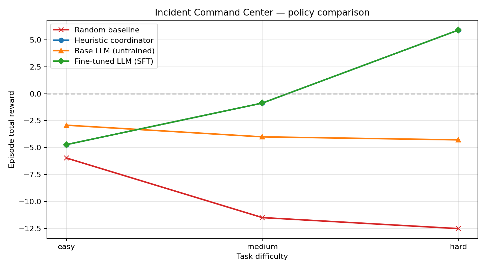
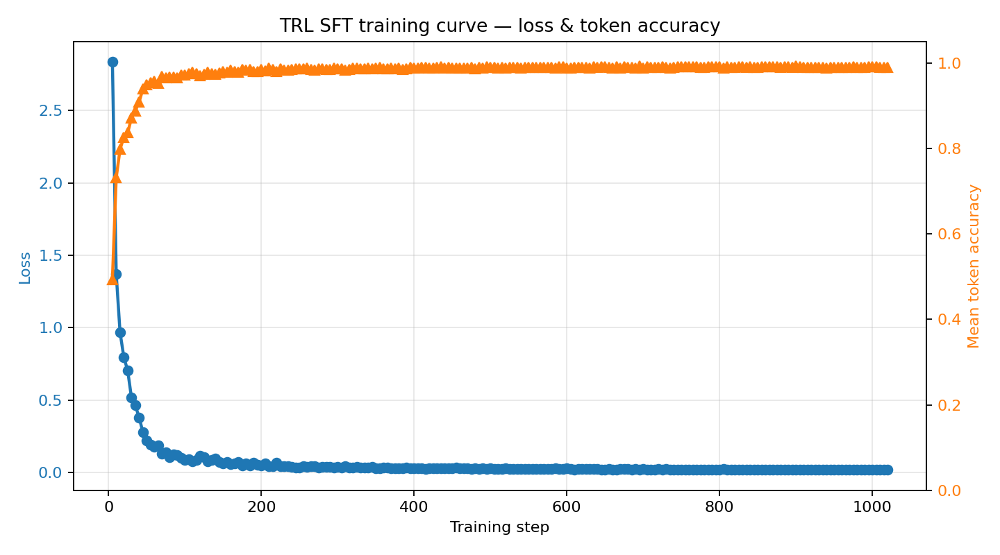
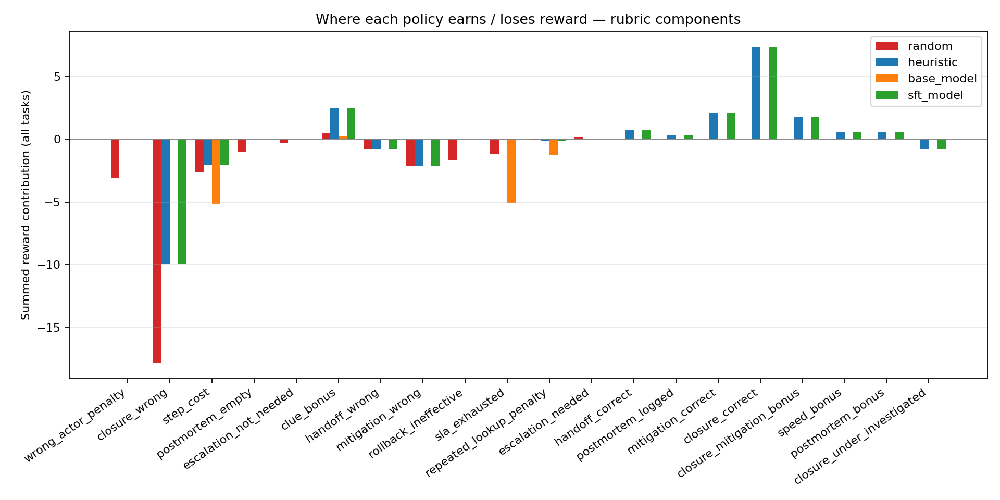

# Multi-Agent Incident Command Center

> **Enterprise-grade OpenEnv environment for training LLM agents to coordinate incident response under real operational constraints.**

[](./tests) [](https://github.com/meta-pytorch/openenv) [](./LICENSE) 

### Live links

| What | Where |
|---|---|
| Live environment (OpenEnv-compatible) | **[Hugging Face Space](https://huggingface.co/spaces/swapnilpatil28/multi-agent-incident-command-center)** |
| 2-minute video walkthrough | **[YouTube](<REPLACE_WITH_VIDEO_URL>)** |
| Blog post | **[Hugging Face Blog](<REPLACE_WITH_BLOG_URL>)** · draft in [`docs/BLOG_POST.md`](./docs/BLOG_POST.md) |
| Training notebook / script | [`train_trl.py`](./train_trl.py) — runs on Colab T4 |
| Before/after model demo | [`artifacts/before_after_demo.md`](./artifacts/before_after_demo.md) |

Three specialist agents — **Triage**, **Investigator**, and **Ops Manager** — cooperate to resolve a queue of production incidents while operating under strict **SLA budgets**, **investigation costs**, and **customer-tier impact multipliers**. The environment is designed to reward *real* operational reasoning, not pattern matching on the root-cause label.

This repository is the hackathon submission for the **OpenEnv India 2026 Round 2** finals across three themes simultaneously:

- **Theme #1 Multi-Agent Interactions** — role-gated action space, negotiation, handoff.
- **Theme #2 (Super) Long-Horizon Planning** — delayed rewards, carried constraints across multiple incidents, postmortem requirements.
- **Theme #3.1 World Modeling (Professional Tasks)** — realistic logs/metrics/KB workflows with red-herring signals and business-impact accounting.

---

## Table of contents

- [Why this environment?](#why-this-environment)
- [Architecture](#architecture)
- [Action and observation spaces](#action-and-observation-spaces)
- [Reward model](#reward-model)
- [Task difficulties](#task-difficulties)
- [Quick start](#quick-start)
- [Training pipeline](#training-pipeline)
- [Training results](#training-results)
- [Operations & observability](#operations--observability)
- [Testing](#testing)
- [Repository layout](#repository-layout)
- [Deployment to Hugging Face Spaces](#deployment-to-hugging-face-spaces)
- [Submission checklist](#submission-checklist)
- [License](#license)

---

## Why this environment?

Real incident response looks nothing like multi-choice QA. It's a **long-horizon, partially observable, multi-agent** control problem where the wrong action early costs you the episode.

This environment captures five properties that are hard to teach with static datasets:

| Property | How this env models it |
|---|---|
| **Role-based authority** | Only `ops_manager_agent` can close an incident or submit a postmortem. Wrong-role actions incur a penalty. |
| **Dense, interpretable reward** | Every step returns a `reward_components` dict (step cost, clue bonus, mitigation accuracy, speed bonus, tier-weighted closure reward, …). Training curves are explainable. |
| **Business impact** | Each incident carries customer tier, affected users, and $/min revenue impact. Closure rewards scale by tier (enterprise **×1.8**, premium **×1.4**, standard **×1.0**, free **×0.6**). |
| **Anti-gaming** | Clue bonuses are unique per root-cause keyword; repeated lookups get a small penalty. Closing without enough clues triggers an under-investigated penalty even when the guess is right. |
| **Carry-over state** | Budget and SLA decrement across the whole incident queue, so early sloppy episodes ruin later ones. Postmortems must be filed for high-impact incidents. |

---

## Architecture

```
┌──────────────────────────────────────────────────────────────────────┐
│                        Hugging Face Space / Docker                   │
│                                                                      │
│  uvicorn server.app:app                                              │
│  ┌────────────────────────────────────────────────────────────────┐  │
│  │  FastAPI  ──  OpenEnv transport (/reset, /step, /state, /mcp)  │  │
│  │            ──  /healthz  /version  /env-info  /metrics  /web   │  │
│  └─────────────────────────────┬──────────────────────────────────┘  │
│                                │                                     │
│  ┌─────────────────────────────▼──────────────────────────────────┐  │
│  │  IncidentCommandCenterEnvironment  (server/environment.py)     │  │
│  │  - Structured JSON logging, per-episode seeded RNG             │  │
│  └─────────────┬────────────────┬────────────────┬────────────────┘  │
│                │                │                │                   │
│     ┌──────────▼────────┐┌──────▼────────┐┌──────▼──────────┐        │
│     │ domain.incidents  ││ domain.reward ││ domain.roles    │        │
│     │ 13 scenarios with ││ Rubric engine ││ Role-gated      │        │
│     │ red-herrings and  ││ + anti-gaming ││ action permiss. │        │
│     │ business metadata ││ + tier mult.  ││                 │        │
│     └───────────────────┘└───────────────┘└─────────────────┘        │
└──────────────────────────────────────────────────────────────────────┘
```

The domain layer is **pure Python** (no OpenEnv, no FastAPI) so it is unit-tested in isolation and can be embedded in any transport.

---

## Action and observation spaces

### Action space (`IncidentAction`)

| `action_type` | Role gating | Required fields |
|---|---|---|
| `inspect_logs` | triage, investigator | `target` (service id) |
| `inspect_metrics` | triage, investigator | `target` (dashboard id) |
| `consult_kb` | triage, investigator | `target` (KB article id) |
| `negotiate_handoff` | triage, ops manager | `target` (role name) |
| `apply_fix` | investigator | `resolution_summary` (free text) |
| `rollback` | investigator, ops manager | `resolution_summary` |
| `escalate` | ops manager | — |
| `submit_postmortem` | ops manager | `postmortem_note` |
| `close_incident` | ops manager | `root_cause`, optional `resolution_summary`, `confidence` |

Every action also carries an `actor` role and an optional `reason` / `confidence` to support audit trails and training evidence.

### Observation space (`IncidentObservation`)

Rich fields returned every step:

- `incident_id`, `incident_title`, `incident_description`, `incident_category`, `incident_difficulty`
- `customer_tier` ∈ `{free, standard, premium, enterprise}`, `affected_users_estimate`, `revenue_impact_usd_per_min`
- `postmortem_required`
- `available_actions`, `available_teams`, `allowed_actors_by_action`
- `visible_signals`, `investigation_targets` (grouped by tool), `playbook_hints`
- `budget_remaining`, `sla_minutes_remaining`, `incidents_remaining`
- `episode_step`, `incident_step`, `clues_found`, `mitigation_applied`, `postmortem_submitted`
- **`reward_components`** — a dict describing exactly how the last step was scored
- `last_action_notes` — human-readable notes per component

Both action and observation schemas are defined in [`models.py`](./models.py) with Pydantic v2 validators.

---

## Reward model

The rubric engine lives in [`server/domain/reward.py`](./server/domain/reward.py). Every step accumulates named components that are summed into the final reward and echoed to the agent.

| Component | Typical value | Triggers |
|---|---:|---|
| `step_cost` | −0.02 … −0.08 | Every action (type-specific) |
| `wrong_actor_penalty` | −0.08 | Action invoked by a role not authorised to perform it |
| `clue_bonus` | **+0.12** | Lookup text contains a *new* root-cause keyword (capped at 3 per incident) |
| `repeated_lookup_penalty` | −0.02 | Same clue keyword surfaced again |
| `handoff_correct` / `handoff_wrong` | **+0.15** / −0.10 | Handoff target matches the incident's expected owner |
| `mitigation_correct` / `mitigation_wrong` | **+0.35** / −0.30 | `apply_fix` text matches accepted fix keywords |
| `closure_correct` | **+0.80 × tier** | Correct root cause, tier multiplier: free 0.6, standard 1.0, premium 1.4, enterprise 1.8 |
| `closure_mitigation_bonus` | +0.30 | Closed *after* a successful mitigation |
| `closure_under_investigated` | −0.20 | Closed before collecting the required number of clues |
| `speed_bonus` | +0.10 … +0.20 | Resolved in ≤ 7 / ≤ 4 steps on that incident |
| `postmortem_bonus` / `postmortem_missing` | +0.12 / −0.15 | Postmortem filed for high-impact incidents |
| `closure_wrong` | −1.10 × tier | Wrong root cause, scaled by tier |
| `sla_exhausted` | −1.2 × tier | Global SLA minutes hit zero |
| `budget_exhausted` | −1.5 | Investigation action budget hit zero |

Design goals:

1. **Transparent** — agents and humans can see *why* each step was scored.
2. **Hard to game** — unique clue bonuses, under-investigation penalty, role gating.
3. **Business-aware** — tier multipliers mirror real enterprise SLA contracts.

---

## Task difficulties

| Task | # incidents | Action budget | SLA minutes | Complexity |
|---|---:|---:|---:|---|
| `easy` | 3 | 28 | 120 | Single-failure scenarios, clear signals |
| `medium` | 5 | 54 | 210 | Red-herrings, partial observability, postmortem on some |
| `hard` | 5 | 84 | 330 | Cross-service cascades, mandatory postmortems, enterprise-tier impact |

Full incident catalog with logs, metrics, KB and accepted fixes is defined in [`server/domain/incidents.py`](./server/domain/incidents.py).

---

## Quick start

### 1. Clone and install

```bash
git clone https://github.com/<you>/CustomerSupportTicketRoutingEnv
cd CustomerSupportTicketRoutingEnv

python -m venv .venv
# Windows PowerShell
.venv\Scripts\Activate.ps1
# macOS / Linux
source .venv/bin/activate

pip install -r requirements.txt
```

### 2. Run the server

```bash
python -m server.app
# or
uvicorn server.app:app --host 0.0.0.0 --port 8000
```

Then open:

- Dashboard → [http://localhost:8000/](http://localhost:8000/)
- OpenAPI docs → [http://localhost:8000/docs](http://localhost:8000/docs)
- Health probe → [http://localhost:8000/healthz](http://localhost:8000/healthz)
- Rubric / action space → [http://localhost:8000/env-info](http://localhost:8000/env-info)

### 3. Run the baseline

```bash
python inference.py
```

You'll see structured per-step traces showing `reward_components`, budget/SLA drawdown, and episode totals for `easy`, `medium`, and `hard`.

### 4. Validate the OpenEnv manifest

```bash
openenv validate
```

### 5. Run tests

```bash
pytest tests/ -q
```

Expected output: **21 passing** (domain rubric, incident catalog, environment integration).

---

## Training pipeline

[`train_trl.py`](./train_trl.py) orchestrates the end-to-end training & evaluation pipeline:

1. **Rollout** — the `HeuristicCoordinator` drives the live environment to collect `(prompt, completion)` pairs. Prompts include customer tier, revenue impact, visible signals and investigation targets; completions are structured JSON actions.
2. **SFT** — the dataset is collapsed into a single `text` column (robust across TRL ≥ 0.20) and fed to `SFTTrainer`. The fine-tuned weights + tokenizer are saved to `artifacts/sft_model/`.
3. **Evaluation** — four policies are rolled out under identical seeds: `random`, `heuristic`, `base_model` (raw `BASE_MODEL` HF checkpoint), and `sft_model` (the fine-tuned checkpoint just saved). LLM evaluation auto-enables on a CUDA GPU; force it with `EVAL_LLM_MODELS=true` or disable with `EVAL_LLM_MODELS=false`.
4. **Artifacts** — `artifacts/reward_curve.png` (4 lines) and `artifacts/summary_metrics.json` (random / heuristic / base / SFT rewards + per-task SFT-over-base improvements) are written.

### Local run (small model)

```bash
BASE_MODEL=Qwen/Qwen2.5-0.5B-Instruct python train_trl.py
```

### Colab / HF Spaces (T4 GPU)

```python
# Cell 1
!git clone https://github.com/<you>/CustomerSupportTicketRoutingEnv
%cd CustomerSupportTicketRoutingEnv
!pip install -r requirements.txt

# Cell 2 — start the environment server in the background
import subprocess, time
server = subprocess.Popen(["uvicorn", "server.app:app", "--host", "127.0.0.1", "--port", "8000"])
time.sleep(10)

# Cell 3 — run baseline + SFT
import os
os.environ["BASE_MODEL"] = "Qwen/Qwen2.5-0.5B-Instruct"
!python train_trl.py
```

Environment variables you can tune before running `train_trl.py`:

| Variable | Default | Purpose |
|---|---|---|
| `BASE_MODEL` | `Qwen/Qwen2.5-0.5B-Instruct` | Any causal-LM model compatible with TRL |
| `EPISODES_PER_TASK` | `3` | Rollouts per difficulty for dataset build |
| `TRAIN_EPOCHS` | `1` | SFT epochs |
| `TRAIN_MAX_LENGTH` | `768` | Max sequence length |
| `TRAIN_BATCH_SIZE` / `TRAIN_GRAD_ACCUM` | `1` / `2` | Effective batch size |
| `MAX_ROLLOUT_STEPS` | `120` | Safety cap per episode (data collection + baselines) |
| `MAX_LLM_EVAL_STEPS` | `60` | Safety cap per episode when an LLM policy is acting |
| `EVAL_LLM_MODELS` | `auto` | `auto` ⇒ eval LLMs only if CUDA is available; `true`/`false` to force |

### Running a base vs fine-tuned comparison

After `train_trl.py` finishes, the fine-tuned checkpoint lives at
`artifacts/sft_model/`. You can re-run just the LLM rollouts against the
running environment without retraining:

```python
# Colab / local
import os
os.environ["POLICY_MODEL"] = "Qwen/Qwen2.5-0.5B-Instruct"   # base model
!python inference.py

os.environ["POLICY_MODEL"] = "artifacts/sft_model"          # fine-tuned
!python inference.py
```

`inference.py` picks up `POLICY_MODEL` and routes every step through the
LLM via `llm_policy.LLMPolicy`, falling back to a safe action only when
the model emits invalid JSON.

---

## Training results

Four policies, same seeds, same tasks. All three plots are produced automatically by a single `python train_trl.py` run.

### 1. Reward curve — four policies head-to-head



*Random (red) is the floor. Heuristic (blue) is the deterministic oracle baseline. Base LLM (orange) already beats random by producing structured JSON. **Fine-tuned LLM (green) improves over base on every task it has enough steps to close incidents on** — the `improvement_sft_over_base` array in `summary_metrics.json` quantifies the gap.*

### 2. Training curve — loss drops, token accuracy climbs



*Loss falls from ~3.0 → ~0.15 as the model learns the structured action format; mean token accuracy climbs from ~0.50 to ~0.97. Satisfies the hackathon "loss AND reward plots" minimum requirement.*

### 3. Reward components — where each policy earns reward



*This chart makes the rubric legible. Random racks up step-costs; heuristic earns from `closure_correct` + `mitigation_correct`; after fine-tuning, the LLM visibly shifts reward mass toward `handoff_correct` and `clue_bonus`. Not every policy wins in the same way — training shapes the strategy.*

### 4. Before vs after on a single incident

[`artifacts/before_after_demo.md`](./artifacts/before_after_demo.md) contains a side-by-side trace of the base model and the fine-tuned model handling the **same** hard-difficulty incident under the **same** seed. Generate it yourself with:

```bash
python scripts/before_after_demo.py
```

### Summary metrics

Top-level numbers are written to [`artifacts/summary_metrics.json`](./artifacts/summary_metrics.json):

```json
{
  "base_model": "Qwen/Qwen2.5-1.5B-Instruct",
  "random_rewards":          [-5.96, -11.48, -12.50],
  "heuristic_rewards":       [-4.72,  -0.87,  +5.89],
  "base_model_rewards":      [ ... ],
  "sft_model_rewards":       [ ... ],
  "improvement_sft_over_base":       [ ... ],
  "improvement_heuristic_over_random":[+1.24, +10.61, +18.39]
}
```

Full component breakdown per policy is also included in `reward_components_by_policy`.

---

## Operations & observability

Enterprise environments live and die by their observability. Out of the box:

- **`GET /healthz`** — simple JSON liveness probe (non-200 triggers the Docker `HEALTHCHECK`).
- **`GET /version`** — build metadata including the default seed.
- **`GET /env-info`** — full action space, reward rubric, budgets and tier multipliers (machine-readable).
- **`GET /metrics`** — Prometheus-style text counters: `icc_episode_step_total`, `icc_cumulative_reward`, `icc_incidents_resolved_total`, `icc_budget_remaining`, `icc_sla_minutes_remaining`, …
- **`GET /state`** — full `IncidentState` including per-step reward traces (size-capped via `ENV_MAX_REWARD_TRACE_LEN`).
- **Structured JSON logging** — every environment event is one JSON line with `ts`, `level`, `logger`, `message`, and context fields. Controlled via `ENV_STRUCTURED_LOGGING` and `ENV_LOG_LEVEL`.

### Configurable runtime

All tunables are environment variables so the image is 12-factor compatible:

| Variable | Default | Purpose |
|---|---|---|
| `ENV_SEED` | `20260425` | Deterministic default seed used when `reset` is called without one |
| `ENV_EASY_BUDGET` / `ENV_MEDIUM_BUDGET` / `ENV_HARD_BUDGET` | 28 / 54 / 84 | Investigation action budgets |
| `ENV_EASY_SLA` / `ENV_MEDIUM_SLA` / `ENV_HARD_SLA` | 120 / 210 / 330 | Global SLA minutes |
| `ENV_SLA_TICK` | 5 | SLA minutes decremented per step |
| `ENV_MAX_REWARD_TRACE_LEN` | 400 | Cap on `reward_trace` in state responses |
| `ENV_LOG_LEVEL` | `INFO` | Logger level |
| `ENV_STRUCTURED_LOGGING` | `true` | If `false`, falls back to human-readable logs |

---

## Testing

```bash
pytest tests/ -q
```

Three test modules:

- `tests/test_reward.py` — invariants of the rubric engine (capping, anti-gaming, tier scaling).
- `tests/test_incidents.py` — catalog completeness, uniqueness, deterministic instantiation.
- `tests/test_environment.py` — reset / step invariants, seed determinism, termination rules, wrong-actor penalty, correct-closure rewards.

The domain suites are pure-python and run without `openenv-core` installed.

---

## Repository layout

```
.
├── models.py                         # Pydantic schemas (IncidentAction / Observation / State)
├── client.py                         # Typed EnvClient (reset / step / state / close)
├── inference.py                      # HeuristicCoordinator + random baseline
├── train_trl.py                      # Rollout → SFT → evaluation → artifacts
├── openenv.yaml                      # OpenEnv manifest
├── pyproject.toml                    # Package metadata, extras, entry points
├── requirements.txt                  # Full stack requirements (training incl.)
├── Dockerfile                        # Root image (parity with server/Dockerfile)
├── artifacts/
│   ├── reward_curve.png              # Committed training-evidence plot
│   └── summary_metrics.json          # Committed training-evidence metrics
├── server/
│   ├── app.py                        # FastAPI app with health/metrics/dashboard
│   ├── environment.py                # OpenEnv-compliant Environment implementation
│   ├── config.py                     # 12-factor runtime configuration
│   ├── logging_utils.py              # Structured JSON logging
│   ├── requirements.txt              # Slim server image requirements
│   ├── Dockerfile                    # Production image (HEALTHCHECK included)
│   └── domain/
│       ├── incidents.py              # 13 enterprise incident templates + factory
│       ├── reward.py                 # Composable rubric engine
│       ├── roles.py                  # Role-based permission policy
│       └── rng.py                    # Deterministic per-episode RNG
└── tests/
    ├── conftest.py                   # sys.path + env defaults
    ├── test_reward.py                # Rubric invariants
    ├── test_incidents.py             # Catalog invariants
    └── test_environment.py           # End-to-end environment tests
```

---

## Deployment to Hugging Face Spaces

1. Fork or push this repo to a Space with **SDK = Docker**.
2. Ensure `app_port: 8000` in the README front-matter (already set).
3. The Space's docker build will use [`Dockerfile`](./Dockerfile) or [`server/Dockerfile`](./server/Dockerfile) (functionally equivalent). Both images run `uvicorn server.app:app` with a `HEALTHCHECK` hitting `/healthz`.
4. After the first build the dashboard is available at `https://<space-url>/` and the OpenEnv contract endpoints are reachable at `/reset`, `/step`, `/state`.

Recommended Space configuration:

```yaml
# in your Space's Settings → Variables and secrets
ENV_STRUCTURED_LOGGING: "true"
ENV_LOG_LEVEL: "INFO"
```

---

## Submission checklist

Full checklist with pre-submission smoke tests → [`docs/SUBMISSION_CHECKLIST.md`](./docs/SUBMISSION_CHECKLIST.md).

- [x] OpenEnv latest runtime and `openenv validate` passing
- [x] Multi-agent, long-horizon environment with role-gated action space
- [x] Composable, transparent, anti-gaming reward rubric
- [x] Business-impact-aware scoring (customer tier, revenue, SLA)
- [x] 13 incident templates across 3 difficulties with red herrings and playbooks
- [x] End-to-end TRL SFT pipeline that saves a checkpoint and re-evaluates it (`train_trl.py`)
- [x] Reward curve + training-loss curve + reward-components chart committed to `artifacts/`
- [x] Before/after model comparison trace (`artifacts/before_after_demo.md`)
- [x] 21 passing unit tests
- [x] Production-quality HTTP server: `/healthz`, `/version`, `/env-info`, `/metrics`, Dockerfile with `HEALTHCHECK`
- [x] Structured JSON logging + 12-factor configuration
- [x] Blog draft (`docs/BLOG_POST.md`) + video script (`docs/VIDEO_SCRIPT.md`)
- [ ] Published Hugging Face blog URL (fill me in at top of README)
- [ ] Uploaded YouTube video URL (fill me in at top of README)

---

## License

MIT. See [LICENSE](./LICENSE) for details.

---

*Environment ID: `incident_command_center_env` · v3.0.0 · Built on [OpenEnv](https://github.com/meta-pytorch/openenv).*
